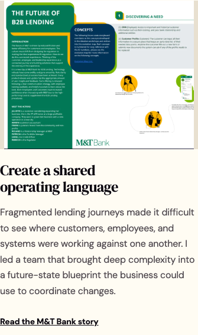
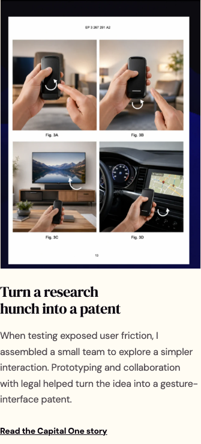

# Build fix report — 10 October 2026

Changes are local to `build/`. Nothing was pushed, deployed, or copied to Livesite. Baseline: `532b4c6`. The separate Blog tweaks chat’s shared theme cookie and cache version changes are preserved in `BLOG-SYNC`; the WordPress package was not modified here.

## Done

| Task | Commit | Change |
|---|---|---|
| CR-4 | `b1be1ad` | Correct granted patent citation and reference link |
| CR-5 | `6149037` | Generate matching testimonials from shared data |
| CR-6 | `a60eaf6` | Move Writing link to footer navigation |
| PO-2 | `c461bd3` | Lead the practice description with enterprise challenges |
| PO-3 | `a256e0f` | Move visual projects into Studio with existing lightbox |
| PO-4 | `fcbb70e` | Use first person in author narrative and clarify collaboration |
| DS-1 | `7ea44c8` | Use Bold label and default theme metadata consistently |
| DS-4 | `ec0257f` | Canonicalize production apex and make internal links relative |
| DS-7 | `5802163` | Clarify the AI FAQ answer and retain human responsibility |
| DS-8 | `5d2a03b` | Use internal arrow glyphs for site links |
| BLOG-SYNC | `833b316` | Preserve theme persistence from the concurrent blog update |
| PO-5 | `196a9b9` | Add sourced role and scope blocks and calculate reading times |
| PO-6 | `61de47e` | Remove implementation labels and align Contact anchor |
| DS-6 | `3c6e14e` | Remove stray UI artifacts and undate public asset directory |
| DS-9 | `96558c6` | Use sentence case eyebrow source and shared presentation rule |
| DS-2 | `627a4aa` | Render case-study listings and titles from one source |
| VQ-1 | `6613547` | Define and apply a seven-step fluid type scale |
| VQ-2 | `4476e78` | Apply consistent spacing tokens to sections and content stacks |
| VQ-3 | `92335d6` | Cap running copy at a readable measure |
| VQ-4 | `c18cc3b` | Make the mobile hero CTA full width and retain visible focus |
| VQ-6 | `3405808` | Enlarge mobile control and footer hit areas |
| VQ-9 | `c4b54d0` | Stop footer motion and carousel smoothing with reduced motion |
| DS-5 | `b6bc080` | Give every case study its own 1200 by 630 social image |
| VQ-7 | `fa352b4` | Serve responsive image variants in all project card listings |
| VQ-11 | `5ae6dcd` | Preload hero portrait and retain font swap loading |
| VQ-10 | `31b4956` | Use shared primary secondary and text-link action variants |
| VQ-8 | `a26f97a` | Unify legacy color roles and strengthen theme contrast |
| VQ-5 | `9bca2dd` | Scale fixed-canvas prototypes to narrow viewports |

VQ-6 enlarged the primary site controls; remaining small targets are flagged below. VQ-10 standardizes the marketing shell; embedded prototype interfaces retain their own controls. VERIFY also removed the error-page refresh that triggered axe and corrected legacy theme-control ARIA semantics. Each task has one commit; the final VERIFY commit contains this report and audit evidence.

## Skipped

| Task | Missing fact |
|---|---|
| CR-1 | NYU_STUDENTS_TOTAL |
| CR-2 | MT_SAVINGS_FIGURE, MT_SAVINGS_SOURCE, VANGUARD_VALUE_FIGURE |
| CR-3 | MT_PROJECT_YEARS |
| PO-1 | SITE_TITLE |
| PO-7 | NAMI_STATUS; entire dependent task left unchanged |
| DS-3 | CONTACT_PATH and CTA_LABEL |

The conflicting student counts, M&T dollar figures and 2019 labels consequently remain. They are unresolved facts, not verified claims. The old patent publication identifier remains only in the existing embed filename; visible citations and the patent destination use the granted patent.

## Needs Van’s review

### PO-2 — enterprise practice sentence

Option 1, applied: “Today, I bring that experience to leaders facing complex services, fragmented systems, and the work of turning strategy into something their teams can deliver.”

Option 2: “Today, I work with leaders to make complex services clearer, connect fragmented systems, and carry strategy into delivery.”

### DS-7 — AI FAQ

Option 1, applied: “I use AI to help synthesize, explore, and support decisions, while keeping responsibility with people. I design for informed choice, so people can examine what the system makes easier or harder and decide how to act.”

Option 2: “I use AI to help people make sense of information, explore possibilities, and make decisions. Responsibility stays with people, along with the ability to question what the system offers and choose how to act.”

### DS-2 — Capital One home headline

Option 1, applied: “Turn a research hunch into a patent.”

Option 2: “Carry a research hunch through to a patent.”

The canonical title is “Capital One gesture patent.” Its short headline serves the imperative home-card treatment; URLs are unchanged.

### PO-6 — Self Care rationale, proposed only

Option 1: “Everyday choices are shaped by the effort an action takes and the defaults around it. Self Care explores whether a small, timely check-in can make a person’s own goals easier to notice and act on. Reminders and defaults should be understandable, adjustable, and easy to dismiss; this prototype does not establish a health or behavior-change benefit.”

Option 2: “Remembering an intention is only part of following through. Finding the right moment and taking the next step also require effort. Self Care explores a lower-friction check-in, with defaults people can change and reminders they can turn off. Whether that approach helps would need to be tested.”

Sources: [Behavioural Insights Team: EAST](https://www.bi.team/east-tool/) and [EAST methodology](https://www.bi.team/east-tool/methodology/) describe reducing effort and making defaults easy to opt out of. [Choice-architecture meta-analysis](https://doi.org/10.1073/pnas.2107346118) offers broader context, not evidence that this prototype works. These paragraphs are design proposals, not efficacy claims. The existing ego-depletion statement is deliberately unchanged pending review.

### CR-5 — testimonials

Both pages now use `data/testimonials.json`. Ashley’s attribution is **Ashley Montgomery**, as confirmed. Quotes are unchanged, including collaborative wording. Supply verbatim LinkedIn text and optional source URLs for final review; no URLs or credentials were invented.

### DS-6 — résumé

Drive links remain with REVIEW comments. Supply `assets/van-shea-sedita-resume.pdf` before replacing those destinations.

### PO-5 — incomplete role and scope fields

- mt-bank-commercial-banking-transformation: Timeline.
- vanguard-innovation-lab-integration: Team.
- nyu-curriculum-alignment: Team.
- nami-delaware-988-campaign: Role, Team.

Other values come from the existing case studies or Experience content; they are not newly verified biography. Reading times use rendered main content divided by 230 words per minute, rounded up.

### REVIEW comment locations

- `aidesign/index.html:202` — `<!-- REVIEW: PO-6 proposed friction and default-design replacement is in FIX-REPORT.md; not applied. -->`
- `assets/experience.html:198` — `<!-- REVIEW: DS-6 retain Drive link until /assets/van-shea-sedita-resume.pdf is supplied. -->`
- `assets/experience.html:240` — `<!-- REVIEW: DS-6 retain Drive link until /assets/van-shea-sedita-resume.pdf is supplied. -->`
- `assets/index.html:314` — `<!-- REVIEW: DS-6 retain Drive link until /assets/van-shea-sedita-resume.pdf is supplied. -->`
- `experience.html:204` — `<!-- REVIEW: DS-6 retain Drive link until /assets/van-shea-sedita-resume.pdf is supplied. -->`
- `index.html:124` — `<!-- REVIEW: DS-2 -->`
- `index.html:151` — `<!-- REVIEW: CR-5 replace with verbatim LinkedIn text -->`
- `index.html:179` — `<!-- REVIEW: PO-2 -->`
- `index.html:228` — `<!-- REVIEW: DS-7 -->`
- `work.html:195` — `<!-- REVIEW: CR-5 replace with verbatim LinkedIn text -->`

## Verification

- 47 current static HTML pages, including AI prototypes and error pages, audited in Chrome at 1440px and 375px in all four site themes: zero axe violations for the tested WCAG A/AA rules. This is automated coverage, not a complete accessibility certification.
- All 47 passed document-width assertions at 360, 375 and 414px. Offscreen carousel/SVG descendants can appear in the diagnostic offender lists without causing document overflow.
- All 62 unique rendered local internal links returned 200 on the actual localhost app. Hash destinations were not separately tested by that HTTP check.
- Static checker: 47 pages, 1,294 local references, zero errors.
- Mobile navigation opened and closed; Escape restored focus to the menu button; the first tab stop was Home. Reduced-motion footer wave computed animation `none`. Testimonials do not automatically advance.
- NYU’s external Google Slides iframe produced `net::ERR_BLOCKED_BY_CLIENT`. No other console errors were recorded. Thus the strict “no console errors on any page” criterion is not fully met.
- The Apache `.htaccess` rule was inspected, but the localhost Node app cannot execute it. The production 301, query preservation on the actual host, cross-subdomain cookie behavior, and native mobile Safari remain unverified.
- No claim of deployment or live-host verification is made.

The audit excludes the separate WordPress blog, nested legacy `build/` snapshot, `_notes`, server templates and archived `large_web_portfolio`. Runtime APIs and the root app were preserved.

### Remaining small tap targets

Main Home, Work, Studio, Experience and case-study controls passed the 44px measurement. These preview/prototype routes still contain smaller controls; the recorded dimensions are in `qa/verification-final.json`:

- `/aidesign/Contact Prototype (standalone).html` — 1 flagged target(s).
- `/aidesign/experiments/stock-performance-test/index.html` — 2 flagged target(s).
- `/aidesign/meeting_coach.html` — 1 flagged target(s).
- `/aidesign/meeting_coach_demo.html` — 1 flagged target(s).
- `/aidesign/partner.html` — 1 flagged target(s).
- `/aidesign/partner_fullscreen.html` — 1 flagged target(s).
- `/aidesign/self_care.html` — 1 flagged target(s).
- `/aidesign/share/contact.html` — 1 flagged target(s).
- `/aidesign/share/meeting-coach.html` — 1 flagged target(s).
- `/aidesign/share/partner.html` — 1 flagged target(s).
- `/aidesign/share/self-care.html` — 1 flagged target(s).
- `/assets/experience.html` — 9 flagged target(s).
- `/assets/home/demos/aidesign--partner.html` — 8 flagged target(s).
- `/assets/home/demos/aidesign--self_care.html` — 5 flagged target(s).
- `/assets/index.html` — 3 flagged target(s).

The scaled embedded prototype controls need a separate layout pass to reach 44 CSS pixels without changing the prototypes’ composition. Wrapper return links and legacy preview controls are also flagged; VQ-6 is therefore partial across the full 47-page scope.

### Evidence files

- `qa/verification-final.json`: full audit merged with the final targeted recheck; `verification.json` and `recheck.json` retain original run records.
- `qa/internal-links.json`: rendered local URLs and responses.
- `qa/before.json` and `qa/type-final.json`: typography and section spacing.
- `qa/button-inventory.json`: button and link style inventory.
- `qa/lighthouse-before.json` and `qa/lighthouse-after.json`: mobile performance.
- `qa/after.json` and the general `*-mobile.png` screenshots are intermediate diagnostics, not final acceptance evidence.

## Before and after

### Typography

Values are font size / line height / weight, from the first matching element on each route. A dash means no such element. A mobile button value of 0 belongs to the icon-only menu control whose accessible label is supplied separately. Lead paragraphs, metadata and prototype content can have role-specific styles; the table exposes those differences rather than implying every paragraph is identical.

Seven shared fluid tokens:

```css
/* Shared presentation tokens for the static Build site. */
:root {
 --type-caption:clamp(.75rem,.72rem + .12vw,.875rem);
 --type-control:clamp(.875rem,.85rem + .1vw,1rem);
 --type-body:clamp(1rem,.98rem + .1vw,1.0625rem);
 --type-h4:clamp(1.25rem,1.15rem + .5vw,1.5rem);
 --type-h3:clamp(1.5rem,1.2rem + 1.4vw,2.5rem);
 --type-h2:clamp(2rem,1.55rem + 1.9vw,3.25rem);
 --type-h1:clamp(2.5rem,1.8rem + 3vw,3.875rem);
 --leading-body:1.65; --leading-heading:1.15;
}

:root { --space-1:4px; --space-2:8px; --space-3:16px; --space-4:24px; --space-5:32px; --space-6:48px; --space-7:64px; --space-section:clamp(48px,6vw,96px); }
```

| Page | Width | Element | Before | After |
|---|---:|---|---|---|
| / | 1440 | h1 | 62px / 70.401px / 400 | 62px / 71.3px / 400 |
| / | 1440 | h2 | 51.84px / 58.0608px / 400 | 52px / 59.8px / 400 |
| / | 1440 | h3 | 40px / 46.4px / 400 | 39.36px / 45.264px / 400 |
| / | 1440 | h4 | — | — |
| / | 1440 | p | 22px / 26px / 600 | 17px / 28.05px / 600 |
| / | 1440 | .eyebrow | 12px / 19.8px / 700 | 13.248px / 19.872px / 700 |
| / | 1440 | figcaption | 12px / 20.64px / 400 | 13.248px / 19.872px / 400 |
| / | 1440 | button | 13px / 15.6px / 700 | 15.04px / 19.552px / 700 |
| / | 375 | h1 | 37px / 41.44px / 400 | 40.05px / 46.0575px / 400 |
| / | 375 | h2 | 34px / 38.08px / 400 | 32px / 36.8px / 400 |
| / | 375 | h3 | 28px / 32.48px / 400 | 24.45px / 28.1175px / 400 |
| / | 375 | h4 | — | — |
| / | 375 | p | 18px / 27.9px / 600 | 16.055px / 26.4907px / 600 |
| / | 375 | .eyebrow | 12px / 19.8px / 700 | 12px / 18px / 700 |
| / | 375 | figcaption | 12px / 20.64px / 400 | 12px / 18px / 400 |
| / | 375 | button | 0px / 0px / 400 | 0px / 0px / 400 |
| /work.html | 1440 | h1 | 62px / 69.44px / 400 | 62px / 71.3px / 400 |
| /work.html | 1440 | h2 | 47.52px / 54.648px / 400 | 52px / 59.8px / 400 |
| /work.html | 1440 | h3 | 36px / 43.2px / 400 | 39.36px / 45.264px / 400 |
| /work.html | 1440 | h4 | — | — |
| /work.html | 1440 | p | 20.88px / 28.8144px / 700 | 20.88px / 28.8144px / 700 |
| /work.html | 1440 | .eyebrow | — | — |
| /work.html | 1440 | figcaption | — | — |
| /work.html | 1440 | button | 18.144px / 31.2077px / 700 | 15.04px / 19.552px / 700 |
| /work.html | 375 | h1 | 40px / 44.8px / 400 | 40.05px / 46.0575px / 400 |
| /work.html | 375 | h2 | 32px / 36.8px / 400 | 32px / 36.8px / 400 |
| /work.html | 375 | h3 | 24px / 28.8px / 400 | 24.45px / 28.1175px / 400 |
| /work.html | 375 | h4 | — | — |
| /work.html | 375 | p | 16.464px / 23.3789px / 700 | 15.68px / 22.2656px / 700 |
| /work.html | 375 | .eyebrow | — | — |
| /work.html | 375 | figcaption | — | — |
| /work.html | 375 | button | 0px / 0px / 400 | 0px / 0px / 400 |
| /studio.html | 1440 | h1 | — | 62px / 71.3px / 400 |
| /studio.html | 1440 | h2 | — | 52px / 59.8px / 400 |
| /studio.html | 1440 | h3 | — | 39.36px / 45.264px / 400 |
| /studio.html | 1440 | h4 | — | — |
| /studio.html | 1440 | p | — | 20.88px / 28.8144px / 700 |
| /studio.html | 1440 | .eyebrow | — | — |
| /studio.html | 1440 | figcaption | — | — |
| /studio.html | 1440 | button | — | 15.04px / 19.552px / 400 |
| /studio.html | 375 | h1 | — | 40.05px / 46.0575px / 400 |
| /studio.html | 375 | h2 | — | 32px / 36.8px / 400 |
| /studio.html | 375 | h3 | — | 24.45px / 28.1175px / 400 |
| /studio.html | 375 | h4 | — | — |
| /studio.html | 375 | p | — | 15.68px / 22.2656px / 700 |
| /studio.html | 375 | .eyebrow | — | — |
| /studio.html | 375 | figcaption | — | — |
| /studio.html | 375 | button | — | 0px / 0px / 400 |
| /case-studies/ | 1440 | h1 | 62px / 69.44px / 400 | 62px / 71.3px / 400 |
| /case-studies/ | 1440 | h2 | 47.52px / 54.648px / 400 | 52px / 59.8px / 400 |
| /case-studies/ | 1440 | h3 | — | — |
| /case-studies/ | 1440 | h4 | — | — |
| /case-studies/ | 1440 | p | 20.88px / 28.8144px / 700 | 20.88px / 28.8144px / 700 |
| /case-studies/ | 1440 | .eyebrow | — | — |
| /case-studies/ | 1440 | figcaption | — | — |
| /case-studies/ | 1440 | button | 13px / 15.6px / 700 | 15.04px / 19.552px / 700 |
| /case-studies/ | 375 | h1 | 40px / 44.8px / 400 | 40.05px / 46.0575px / 400 |
| /case-studies/ | 375 | h2 | 32px / 36.8px / 400 | 32px / 36.8px / 400 |
| /case-studies/ | 375 | h3 | — | — |
| /case-studies/ | 375 | h4 | — | — |
| /case-studies/ | 375 | p | 16.464px / 23.3789px / 700 | 15.68px / 22.2656px / 700 |
| /case-studies/ | 375 | .eyebrow | — | — |
| /case-studies/ | 375 | figcaption | — | — |
| /case-studies/ | 375 | button | 0px / 0px / 400 | 0px / 0px / 400 |
| /experience.html | 1440 | h1 | 62px / 69.44px / 400 | 62px / 71.3px / 400 |
| /experience.html | 1440 | h2 | 47.52px / 54.648px / 400 | 52px / 59.8px / 400 |
| /experience.html | 1440 | h3 | 36px / 43.2px / 400 | 39.36px / 45.264px / 400 |
| /experience.html | 1440 | h4 | — | — |
| /experience.html | 1440 | p | 17.85px / 31.2375px / 700 | 17px / 28.05px / 700 |
| /experience.html | 1440 | .eyebrow | — | — |
| /experience.html | 1440 | figcaption | — | — |
| /experience.html | 1440 | button | 15.96px / 27.4512px / 800 | 15.04px / 19.552px / 700 |
| /experience.html | 375 | h1 | 40px / 44.8px / 400 | 40.05px / 46.0575px / 400 |
| /experience.html | 375 | h2 | 32px / 36.8px / 400 | 32px / 36.8px / 400 |
| /experience.html | 375 | h3 | 24px / 28.8px / 400 | 24.45px / 28.1175px / 400 |
| /experience.html | 375 | h4 | — | — |
| /experience.html | 375 | p | 17.85px / 31.2375px / 700 | 16.055px / 26.4907px / 700 |
| /experience.html | 375 | .eyebrow | — | — |
| /experience.html | 375 | figcaption | — | — |
| /experience.html | 375 | button | 0px / 0px / 400 | 0px / 0px / 400 |
| /aidesign/ | 1440 | h1 | 62px / 69.44px / 400 | 62px / 71.3px / 400 |
| /aidesign/ | 1440 | h2 | 47.52px / 54.648px / 400 | 52px / 59.8px / 400 |
| /aidesign/ | 1440 | h3 | 36px / 43.2px / 400 | 39.36px / 45.264px / 400 |
| /aidesign/ | 1440 | h4 | — | — |
| /aidesign/ | 1440 | p | 17.85px / 30.345px / 400 | 17px / 28.9px / 400 |
| /aidesign/ | 1440 | .eyebrow | — | — |
| /aidesign/ | 1440 | figcaption | — | — |
| /aidesign/ | 1440 | button | 17px / 29.24px / 400 | 15.04px / 19.552px / 400 |
| /aidesign/ | 375 | h1 | 40px / 44.8px / 400 | 40.05px / 46.0575px / 400 |
| /aidesign/ | 375 | h2 | 32px / 36.8px / 400 | 32px / 36.8px / 400 |
| /aidesign/ | 375 | h3 | 24px / 28.8px / 400 | 24.45px / 28.1175px / 400 |
| /aidesign/ | 375 | h4 | — | — |
| /aidesign/ | 375 | p | 17.85px / 30.345px / 400 | 16.055px / 27.2935px / 400 |
| /aidesign/ | 375 | .eyebrow | — | — |
| /aidesign/ | 375 | figcaption | — | — |
| /aidesign/ | 375 | button | 0px / 0px / 400 | 0px / 0px / 400 |
| /case-studies/capital-one-gesture-patent/ | 1440 | h1 | 62px / 69.44px / 400 | 62px / 71.3px / 400 |
| /case-studies/capital-one-gesture-patent/ | 1440 | h2 | 47.52px / 54.648px / 400 | 52px / 59.8px / 400 |
| /case-studies/capital-one-gesture-patent/ | 1440 | h3 | — | — |
| /case-studies/capital-one-gesture-patent/ | 1440 | h4 | — | — |
| /case-studies/capital-one-gesture-patent/ | 1440 | p | 17.85px / 31.2375px / 700 | 17px / 28.05px / 700 |
| /case-studies/capital-one-gesture-patent/ | 1440 | .eyebrow | — | — |
| /case-studies/capital-one-gesture-patent/ | 1440 | figcaption | 15.12px / 26.0064px / 400 | 13.248px / 19.872px / 400 |
| /case-studies/capital-one-gesture-patent/ | 1440 | button | 13px / 15.6px / 700 | 15.04px / 19.552px / 700 |
| /case-studies/capital-one-gesture-patent/ | 375 | h1 | 40px / 44.8px / 400 | 40.05px / 46.0575px / 400 |
| /case-studies/capital-one-gesture-patent/ | 375 | h2 | 32px / 36.8px / 400 | 32px / 36.8px / 400 |
| /case-studies/capital-one-gesture-patent/ | 375 | h3 | — | — |
| /case-studies/capital-one-gesture-patent/ | 375 | h4 | — | — |
| /case-studies/capital-one-gesture-patent/ | 375 | p | 17.85px / 31.2375px / 700 | 16.055px / 26.4907px / 700 |
| /case-studies/capital-one-gesture-patent/ | 375 | .eyebrow | — | — |
| /case-studies/capital-one-gesture-patent/ | 375 | figcaption | 15.12px / 24.948px / 400 | 12px / 18px / 400 |
| /case-studies/capital-one-gesture-patent/ | 375 | button | 0px / 0px / 400 | 0px / 0px / 400 |
| /case-studies/mt-bank-commercial-banking-transformation/ | 1440 | h1 | 62px / 69.44px / 400 | 62px / 71.3px / 400 |
| /case-studies/mt-bank-commercial-banking-transformation/ | 1440 | h2 | 47.52px / 54.648px / 400 | 52px / 59.8px / 400 |
| /case-studies/mt-bank-commercial-banking-transformation/ | 1440 | h3 | — | — |
| /case-studies/mt-bank-commercial-banking-transformation/ | 1440 | h4 | — | — |
| /case-studies/mt-bank-commercial-banking-transformation/ | 1440 | p | 17.85px / 31.2375px / 700 | 17px / 28.05px / 700 |
| /case-studies/mt-bank-commercial-banking-transformation/ | 1440 | .eyebrow | — | — |
| /case-studies/mt-bank-commercial-banking-transformation/ | 1440 | figcaption | — | — |
| /case-studies/mt-bank-commercial-banking-transformation/ | 1440 | button | 13px / 15.6px / 700 | 15.04px / 19.552px / 700 |
| /case-studies/mt-bank-commercial-banking-transformation/ | 375 | h1 | 40px / 44.8px / 400 | 40.05px / 46.0575px / 400 |
| /case-studies/mt-bank-commercial-banking-transformation/ | 375 | h2 | 32px / 36.8px / 400 | 32px / 36.8px / 400 |
| /case-studies/mt-bank-commercial-banking-transformation/ | 375 | h3 | — | — |
| /case-studies/mt-bank-commercial-banking-transformation/ | 375 | h4 | — | — |
| /case-studies/mt-bank-commercial-banking-transformation/ | 375 | p | 17.85px / 31.2375px / 700 | 16.055px / 26.4907px / 700 |
| /case-studies/mt-bank-commercial-banking-transformation/ | 375 | .eyebrow | — | — |
| /case-studies/mt-bank-commercial-banking-transformation/ | 375 | figcaption | — | — |
| /case-studies/mt-bank-commercial-banking-transformation/ | 375 | button | 0px / 0px / 400 | 0px / 0px / 400 |
| /case-studies/nami-delaware-988-campaign/ | 1440 | h1 | 62px / 69.44px / 400 | 62px / 71.3px / 400 |
| /case-studies/nami-delaware-988-campaign/ | 1440 | h2 | 47.52px / 54.648px / 400 | 52px / 59.8px / 400 |
| /case-studies/nami-delaware-988-campaign/ | 1440 | h3 | — | — |
| /case-studies/nami-delaware-988-campaign/ | 1440 | h4 | — | — |
| /case-studies/nami-delaware-988-campaign/ | 1440 | p | 17.85px / 31.2375px / 700 | 17px / 28.05px / 700 |
| /case-studies/nami-delaware-988-campaign/ | 1440 | .eyebrow | — | — |
| /case-studies/nami-delaware-988-campaign/ | 1440 | figcaption | 15.96px / 27.4512px / 400 | 13.248px / 19.872px / 400 |
| /case-studies/nami-delaware-988-campaign/ | 1440 | button | 17px / 29.24px / 400 | 15.04px / 19.552px / 400 |
| /case-studies/nami-delaware-988-campaign/ | 375 | h1 | 40px / 44.8px / 400 | 40.05px / 46.0575px / 400 |
| /case-studies/nami-delaware-988-campaign/ | 375 | h2 | 32px / 36.8px / 400 | 32px / 36.8px / 400 |
| /case-studies/nami-delaware-988-campaign/ | 375 | h3 | — | — |
| /case-studies/nami-delaware-988-campaign/ | 375 | h4 | — | — |
| /case-studies/nami-delaware-988-campaign/ | 375 | p | 17.85px / 31.2375px / 700 | 16.055px / 26.4907px / 700 |
| /case-studies/nami-delaware-988-campaign/ | 375 | .eyebrow | — | — |
| /case-studies/nami-delaware-988-campaign/ | 375 | figcaption | 15.96px / 27.4512px / 400 | 12px / 18px / 400 |
| /case-studies/nami-delaware-988-campaign/ | 375 | button | 0px / 0px / 400 | 0px / 0px / 400 |
| /case-studies/nyu-curriculum-alignment/ | 1440 | h1 | 62px / 69.44px / 400 | 62px / 71.3px / 400 |
| /case-studies/nyu-curriculum-alignment/ | 1440 | h2 | 47.52px / 54.648px / 400 | 52px / 59.8px / 400 |
| /case-studies/nyu-curriculum-alignment/ | 1440 | h3 | — | — |
| /case-studies/nyu-curriculum-alignment/ | 1440 | h4 | — | — |
| /case-studies/nyu-curriculum-alignment/ | 1440 | p | 17.85px / 31.2375px / 700 | 17px / 28.05px / 700 |
| /case-studies/nyu-curriculum-alignment/ | 1440 | .eyebrow | — | — |
| /case-studies/nyu-curriculum-alignment/ | 1440 | figcaption | — | — |
| /case-studies/nyu-curriculum-alignment/ | 1440 | button | 13px / 15.6px / 700 | 15.04px / 19.552px / 700 |
| /case-studies/nyu-curriculum-alignment/ | 375 | h1 | 40px / 44.8px / 400 | 40.05px / 46.0575px / 400 |
| /case-studies/nyu-curriculum-alignment/ | 375 | h2 | 32px / 36.8px / 400 | 32px / 36.8px / 400 |
| /case-studies/nyu-curriculum-alignment/ | 375 | h3 | — | — |
| /case-studies/nyu-curriculum-alignment/ | 375 | h4 | — | — |
| /case-studies/nyu-curriculum-alignment/ | 375 | p | 17.85px / 31.2375px / 700 | 16.055px / 26.4907px / 700 |
| /case-studies/nyu-curriculum-alignment/ | 375 | .eyebrow | — | — |
| /case-studies/nyu-curriculum-alignment/ | 375 | figcaption | — | — |
| /case-studies/nyu-curriculum-alignment/ | 375 | button | 0px / 0px / 400 | 0px / 0px / 400 |
| /case-studies/vanguard-innovation-lab-integration/ | 1440 | h1 | 62px / 69.44px / 400 | 62px / 71.3px / 400 |
| /case-studies/vanguard-innovation-lab-integration/ | 1440 | h2 | 47.52px / 54.648px / 400 | 52px / 59.8px / 400 |
| /case-studies/vanguard-innovation-lab-integration/ | 1440 | h3 | — | — |
| /case-studies/vanguard-innovation-lab-integration/ | 1440 | h4 | — | — |
| /case-studies/vanguard-innovation-lab-integration/ | 1440 | p | 17.85px / 31.2375px / 700 | 17px / 28.05px / 700 |
| /case-studies/vanguard-innovation-lab-integration/ | 1440 | .eyebrow | — | — |
| /case-studies/vanguard-innovation-lab-integration/ | 1440 | figcaption | — | — |
| /case-studies/vanguard-innovation-lab-integration/ | 1440 | button | 13px / 15.6px / 700 | 15.04px / 19.552px / 700 |
| /case-studies/vanguard-innovation-lab-integration/ | 375 | h1 | 40px / 44.8px / 400 | 40.05px / 46.0575px / 400 |
| /case-studies/vanguard-innovation-lab-integration/ | 375 | h2 | 32px / 36.8px / 400 | 32px / 36.8px / 400 |
| /case-studies/vanguard-innovation-lab-integration/ | 375 | h3 | — | — |
| /case-studies/vanguard-innovation-lab-integration/ | 375 | h4 | — | — |
| /case-studies/vanguard-innovation-lab-integration/ | 375 | p | 17.85px / 31.2375px / 700 | 16.055px / 26.4907px / 700 |
| /case-studies/vanguard-innovation-lab-integration/ | 375 | .eyebrow | — | — |
| /case-studies/vanguard-innovation-lab-integration/ | 375 | figcaption | — | — |
| /case-studies/vanguard-innovation-lab-integration/ | 375 | button | 0px / 0px / 400 | 0px / 0px / 400 |

### Spacing

Spacing tokens are 4, 8, 16, 24, 32, 48 and 64px; section spacing is `clamp(48px,6vw,96px)`. Shared content stacks use token gaps. Section measurements below are from the 1440px home audit.

| Section | Before padding | After padding |
|---|---|---|
| human-agency | 8px 0px 64px | 8px 0px 64px |
| journey | 56px 0px | 86.4px 0px |
| work | 108px 0px | 86.4px 0px |
| approach | 108px 0px | 86.4px 0px |
| about | 108px 0px | 86.4px 0px |
| ai-design | 96px 24px | 86.4px 24px |
| faq | 80px 0px | 86.4px 0px |
| contact | 100px 0px | 100px 0px |

### Lighthouse mobile

Single before/after lab runs against the same isolated static localhost server and mobile preset. Results vary between runs; runtime browser checks used the actual localhost app separately.

| Page | LCP before → after | CLS before → after | Image bytes before → after | Performance score |
|---|---|---|---|---|
| / | 4.03s → 2.25s | 0.106 → 0.104 | 2,063,670 → 320,886 | 77 → 95 |
| /case-studies/mt-bank-commercial-banking-transformation/ | 4.51s → 3.08s | 0.162 → 0.121 | 47,124 → 47,124 | 69 → 88 |

CLS improved but remains above 0.1 in these runs. M&T LCP remains above 2.5 seconds. Hero preload, font swap and responsive card images are in place; this is not a claim that all performance thresholds are met.

### Requested 375px card screenshots





Responsive WebP variants are 480, 960 and 1600px. The two dense cards have dedicated mobile crops via picture sources.

## PO-4 sentence changes

- `index.html`
  - Before: We map what customers see alongside the employee work, policies, technology, and handoffs behind it, so the team can see where intent gets lost and which decisions matter next.
  - After: I map what customers see alongside the employee work, policies, technology, and handoffs behind it, so the team can see where intent gets lost and which decisions matter next.
- `index.html`
  - Before: The people accountable for the direction and the people doing the work both need a voice. We bring their perspectives into the same conversation and make tradeoffs visible before they become delivery surprises.
  - After: The people accountable for the direction and the people doing the work both need a voice. I bring their perspectives into the same conversation and make tradeoffs visible before they become delivery surprises.
- `index.html`
  - Before: We turn broad goals into usable and clear blueprints, prototypes, and working rhythms that teams can test, question, and refine, staying close enough to delivery to see where the approach needs to change.
  - After: I turn broad goals into usable and clear blueprints, prototypes, and working rhythms that teams can test, question, and refine, staying close enough to delivery to see where the approach needs to change.
- `index.html`
  - Before: We define the approach together, then work alongside your team to test it in practice. The aim is a system your people understand, can question, and can own.
  - After: We define the approach together, then I work alongside your team to test it in practice. The aim is a system your people understand, can question, and can own.
- `case-studies/index.html`
  - Before: Van expanded NYU’s information architecture curriculum beyond classification methods into a broader human-centered UX process.
  - After: I expanded NYU’s information architecture curriculum beyond classification methods into a broader human-centered UX process.
- `case-studies/index.html`
  - Before: Fragmented processes and repeated handoffs created friction and waste. Van turned research and journey maps into a service blueprint for commercial lending.
  - After: Fragmented processes and repeated handoffs created friction and waste. I turned research and journey maps into a service blueprint for commercial lending.
- `case-studies/index.html`
  - Before: Vanguard needed a voice-interface strategy that protected client trust. Van led research and prototypes connecting security concepts to business needs, analytics, and legacy systems.
  - After: Vanguard needed a voice-interface strategy that protected client trust. I led research and prototypes connecting security concepts to business needs, analytics, and legacy systems.
- `case-studies/index.html`
  - Before: A closer look at how we make complex services visible, test new interactions, and help teams move from evidence to action.
  - After: A closer look at how I make complex services visible, test new interactions, and help teams move from evidence to action.
- `case-studies/nyu-curriculum-alignment/index.html`
  - Before: Van expanded NYU’s information architecture curriculum beyond classification methods into a broader human-centered UX process.
  - After: I expanded NYU’s information architecture curriculum beyond classification methods into a broader human-centered UX process.
- `case-studies/nyu-curriculum-alignment/index.html`
  - Before: Van expanded the course beyond organization and classification methods to include user goals, behavior, research, usability, and real-world context.
  - After: I expanded the course beyond organization and classification methods to include user goals, behavior, research, usability, and real-world context.
- `case-studies/nyu-curriculum-alignment/index.html`
  - Before: Van helped students move from organizing information to understanding people, giving them a stronger foundation in research and evidence-based design.
  - After: I helped students move from organizing information to understanding people, giving them a stronger foundation in research and evidence-based design.
- `case-studies/capital-one-gesture-patent/index.html`
  - Before: Van turned a usability problem into a prototype, an executive story, and a patent supported by legal partners.
  - After: I turned a usability problem into a prototype, an executive story, and a patent supported by legal partners.
- `case-studies/vanguard-innovation-lab-integration/index.html`
  - Before: Vanguard needed a voice-interface strategy that protected client trust. Van led research and prototypes connecting security concepts to business needs, analytics, and legacy systems.
  - After: Vanguard needed a voice-interface strategy that protected client trust. I led research and prototypes connecting security concepts to business needs, analytics, and legacy systems.
- `case-studies/vanguard-innovation-lab-integration/index.html`
  - Before: Van led research, prototypes, and security experience design, grounding the work in client usage data, analytics, current systems, and legacy constraints.
  - After: I led research, prototypes, and security experience design, grounding the work in client usage data, analytics, current systems, and legacy constraints.
- `case-studies/vanguard-innovation-lab-integration/index.html`
  - Before: He also directed smart-home concepts that helped leaders evaluate the market, client experience, and operational readiness.
  - After: I also directed smart-home concepts that helped leaders evaluate the market, client experience, and operational readiness.
- `case-studies/vanguard-innovation-lab-integration/index.html`
  - Before: Van turned an abstract voice-device question into an actionable roadmap connecting market opportunity, client trust, security, systems, and prototypes.
  - After: I turned an abstract voice-device question into an actionable roadmap connecting market opportunity, client trust, security, systems, and prototypes.
- `case-studies/mt-bank-commercial-banking-transformation/index.html`
  - Before: Fragmented processes and repeated handoffs created friction and waste. Van turned research and journey maps into a service blueprint for commercial lending.
  - After: Fragmented processes and repeated handoffs created friction and waste. I turned research and journey maps into a service blueprint for commercial lending.
- `case-studies/mt-bank-commercial-banking-transformation/index.html`
  - Before: Van organized scattered feedback into a clear service design narrative. He guided service and UX designers, refined concepts, and shaped the story for senior stakeholders.
  - After: I organized scattered feedback into a clear service design narrative. I guided service and UX designers, refined concepts, and shaped the story for senior stakeholders.
- `case-studies/mt-bank-commercial-banking-transformation/index.html`
  - Before: Van made the lending ecosystem visible and turned scattered feedback into a future-state story stakeholders could use.
  - After: I made the lending ecosystem visible and turned scattered feedback into a future-state story stakeholders could use.
- `assets/index.html`
  - Before: Vanguard needed a market point of view on smart-home voice interfaces while protecting client trust. Van led the design research strategy, prototyped real solutions, and connected security concepts to business, analytics, and legacy systems.
  - After: Vanguard needed a market point of view on smart-home voice interfaces while protecting client trust. I led the design research strategy, prototyped real solutions, and connected security concepts to business, analytics, and legacy systems.
- `assets/index.html`
  - Before: M&T Bank's commercial banking experience was shaped by fragmented processes, repeated handoffs, and operational waste. Van helped turn research and journey mapping into a clearer service blueprint for future commercial lending.
  - After: M&T Bank's commercial banking experience was shaped by fragmented processes, repeated handoffs, and operational waste. I helped turn research and journey mapping into a clearer service blueprint for future commercial lending.
- `assets/index.html`
  - Before: At NYU, Van expanded Information Architecture beyond static classification methods and reframed it as part of a broader human-centered UX process.
  - After: At NYU, I expanded Information Architecture beyond static classification methods and reframed it as part of a broader human-centered UX process.
- `case-studies/index.html`
  - Before: Testing showed that customers struggled with too many screens. Van assembled a small team, led the prototype, and helped develop the concept into a patent.
  - After: Testing showed that customers struggled with too many screens. I assembled a small team, led the prototype, and helped develop the concept into a patent.
- `case-studies/nyu-curriculum-alignment/index.html`
  - Before: <meta name="description" content="See how Van Shea Sedita expanded NYU’s information architecture curriculum into a broader human-centered UX process for students and practitioners.">
  - After: <meta name="description" content="See how I expanded NYU’s information architecture curriculum into a broader human-centered UX process for students and practitioners.">
- `case-studies/nyu-curriculum-alignment/index.html`
  - Before: <meta property="og:description" content="See how Van Shea Sedita expanded NYU’s information architecture curriculum into a broader human-centered UX process for students and practitioners.">
  - After: <meta property="og:description" content="See how I expanded NYU’s information architecture curriculum into a broader human-centered UX process for students and practitioners.">
- `case-studies/nyu-curriculum-alignment/index.html`
  - Before: <meta name="twitter:description" content="See how Van Shea Sedita expanded NYU’s information architecture curriculum into a broader human-centered UX process for students and practitioners.">
  - After: <meta name="twitter:description" content="See how I expanded NYU’s information architecture curriculum into a broader human-centered UX process for students and practitioners.">
- `case-studies/capital-one-gesture-patent/index.html`
  - Before: Testing showed that customers struggled with too many screens. Van assembled a small team, led the prototype, and helped develop the concept into a patent.
  - After: Testing showed that customers struggled with too many screens. I assembled a small team, led the prototype, and helped develop the concept into a patent.
- `case-studies/capital-one-gesture-patent/index.html`
  - Before: Van assembled a small team and led prototype development and technical revisions. The concept earned second place at a hackathon.
  - After: I assembled a small team and led prototype development and technical revisions. The concept earned second place at a hackathon.
- `case-studies/capital-one-gesture-patent/index.html`
  - Before: He then created a concept video and executive presentation. Collaboration with the legal team developed the idea into a patent.
  - After: I then created a concept video and executive presentation. Collaboration with the legal team developed the idea into a patent.
- `case-studies/capital-one-gesture-patent/index.html`
  - Before: <meta name="description" content="Testing showed customers struggled with too many screens. Van Shea Sedita led a prototype team and helped develop the concept into a gesture-interface patent.">
  - After: <meta name="description" content="Testing showed customers struggled with too many screens. I led a prototype team and helped develop the concept into a gesture-interface patent.">
- `case-studies/capital-one-gesture-patent/index.html`
  - Before: <meta property="og:description" content="Testing showed customers struggled with too many screens. Van Shea Sedita led a prototype team and helped develop the concept into a gesture-interface patent.">
  - After: <meta property="og:description" content="Testing showed customers struggled with too many screens. I led a prototype team and helped develop the concept into a gesture-interface patent.">
- `case-studies/capital-one-gesture-patent/index.html`
  - Before: <meta name="twitter:description" content="Testing showed customers struggled with too many screens. Van Shea Sedita led a prototype team and helped develop the concept into a gesture-interface patent.">
  - After: <meta name="twitter:description" content="Testing showed customers struggled with too many screens. I led a prototype team and helped develop the concept into a gesture-interface patent.">
- `case-studies/vanguard-innovation-lab-integration/index.html`
  - Before: <meta name="description" content="See how Van Shea Sedita connected voice-interface security concepts to client trust, business needs, analytics, and legacy systems at Vanguard.">
  - After: <meta name="description" content="See how I connected voice-interface security concepts to client trust, business needs, analytics, and legacy systems at Vanguard.">
- `case-studies/vanguard-innovation-lab-integration/index.html`
  - Before: <meta property="og:description" content="See how Van Shea Sedita connected voice-interface security concepts to client trust, business needs, analytics, and legacy systems at Vanguard.">
  - After: <meta property="og:description" content="See how I connected voice-interface security concepts to client trust, business needs, analytics, and legacy systems at Vanguard.">
- `case-studies/vanguard-innovation-lab-integration/index.html`
  - Before: <meta name="twitter:description" content="See how Van Shea Sedita connected voice-interface security concepts to client trust, business needs, analytics, and legacy systems at Vanguard.">
  - After: <meta name="twitter:description" content="See how I connected voice-interface security concepts to client trust, business needs, analytics, and legacy systems at Vanguard.">
- `case-studies/mt-bank-commercial-banking-transformation/index.html`
  - Before: <meta name="description" content="See how Van Shea Sedita used research, journey maps, and service blueprinting to address fragmented processes in commercial lending at M&amp;T Bank.">
  - After: <meta name="description" content="See how I used research, journey maps, and service blueprinting to address fragmented processes in commercial lending at M&amp;T Bank.">
- `case-studies/mt-bank-commercial-banking-transformation/index.html`
  - Before: <meta property="og:description" content="See how Van Shea Sedita used research, journey maps, and service blueprinting to address fragmented processes in commercial lending at M&amp;T Bank.">
  - After: <meta property="og:description" content="See how I used research, journey maps, and service blueprinting to address fragmented processes in commercial lending at M&amp;T Bank.">
- `case-studies/mt-bank-commercial-banking-transformation/index.html`
  - Before: <meta name="twitter:description" content="See how Van Shea Sedita used research, journey maps, and service blueprinting to address fragmented processes in commercial lending at M&amp;T Bank.">
  - After: <meta name="twitter:description" content="See how I used research, journey maps, and service blueprinting to address fragmented processes in commercial lending at M&amp;T Bank.">
- `assets/index.html`
  - Before: Capital One customers were struggling with too many screens during testing. Van assembled a small team, led prototype development, and helped turn the concept into a patented gesture-interface direction.
  - After: Capital One customers were struggling with too many screens during testing. I assembled a small team, led prototype development, and helped turn the concept into a patented gesture-interface direction.

## Files to upload

See [UPLOAD-FILES.md](UPLOAD-FILES.md) for the complete, exact public-file manifest and upload order. Data, render scripts, server templates and QA evidence are source/maintenance files, not static-host uploads.

## Follow-up: top spacing alignment (10 October 2026)

Work, Case studies, AI Design Lab, Experience, and the matching Studio shell now share a page-top spacing token: 76px below the header at desktop widths and 52px at 375px. Work's inherited theme hero margin and top padding were removed, and AI Design Lab now uses the shared content width. The five affected HTML pages use fresh CSS query versions so cached styles do not obscure the correction.

A subsequent Chrome check covered these five pages in all four themes at 1440px and 375px: all 40 heading positions matched (152px and 127px from the viewport top respectively), and none overflowed horizontally. The earlier `qa/` snapshots predate this follow-up; they remain evidence for the initial fix pass rather than a current spacing comparison. This follow-up is local Build verification, not a live-site check.
